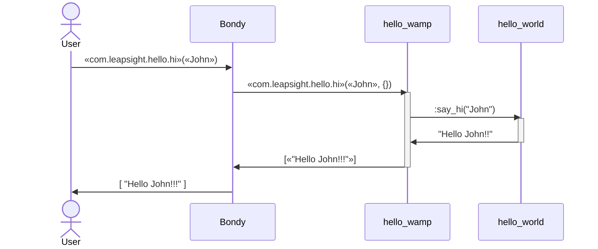

Hello World
=====

## WAMP microservice

Simple WAMP Microservice that registers a RPC call `«com.leapsight.hello.hi»` 
URI which handles a `«{Param}»` message sending back a `[«"Hello {Param}!!!"»]` message.



## Run Docker Microservice

#### 1. Start the service & the client and confirm the connectivity
```shell
> make dockerrun
docker run \
		--network=host \
		--rm \
		-e CLUSTER_NAME="localhost" \
		-e LOG_LEVEL=debug \
		-e REPLICAS=1 \
		-e RIAK_BUCKET_TYPE="resources_type" \
		-e RIAK_HOST="localhost" \
		-e RIAK_PORT=8087 \
		-e WAMP_ENCODING=json \
		-e WAMP_HOST="localhost" \
		-e WAMP_PORT=18082 \
		-e WAMP_REALM="com.leapsight.bondy" \
		-e ERLANG_NODENAME=hello_world-0@localhost \
		--name hello_world \
		hello_world:dev
Exec: /opt/hello_world/erts-14.2.1/bin/erlexec -noinput +Bd -boot /opt/hello_world/releases/0.1.0/start -mode embedded -boot_var SYSTEM_LIB_DIR /opt/hello_world/lib -config /opt/hello_world/releases/0.1.0/sys.config -args_file /opt/hello_world/releases/0.1.0/vm.args -- foreground
Root: /opt/hello_world
/opt/hello_world
19:43:14.791 [info] registering procedure uri=<<"com.leapsight.hello.hi">> ...
Running hello_server on 'hello_world-0@localhost' :{ok,<0.504.0>}
19:43:14.792 [info] registered reg_id=6638908513132129.
```


#### 2. Called `say_hi`


<table>
<tr>
<th>hello_server</th>
<th>User</th>
</tr>
<tr>
<td id="shell1">

```shell
> make dockerrun
[***]
19:43:14.792 [info] registered reg_id=6638908513132129.


hello_wamp message: Hello John!!!

```

</td>
<td id="shell2">

```shell
❯ wick \
    --realm="com.leapsight.bondy" \
    --url=ws://localhost:18080/ws \
    call \
    com.leapsight.hello.hi \
    John
[
    "Hello John!!!"
]
```
</td>
</tr>
</table>


